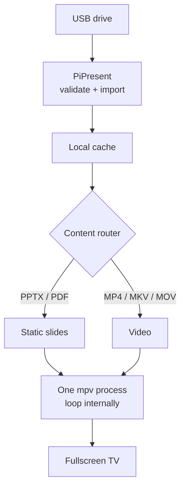

<div align="center">


### Plug in a USB. Boot the Pi. Let the presentation run.

PowerPoint · PDF · Video → Raspberry Pi → TV

[](https://github.com/pierrickvhk/pipresent/actions/workflows/ci.yml)


[](LICENSE)

[Quick start](#quick-start) · [Nederlandse handleiding](README.nl.md) · [Technical guide](README.technical.md)

</div>

PiPresent turns a Raspberry Pi into a fullscreen presentation player. It imports content from
USB, saves a local copy, and keeps it looping—even after you remove the drive or reboot without it.
Python handles the automation; LibreOffice, Poppler and mpv handle the media.

## Why I built this

The Raspberry Pi setup already played presentations exported as video. But every time a video
ended and restarted, the screen briefly went black. Small problem. Very noticeable on a display
that's supposed to keep running.

I wanted to find out: **could I fix the playback loop properly, and support actual presentation
files too?** That became PiPresent: automatic USB import, a local cache, and a small pipeline
for PowerPoint, PDF and video.

The key decision was to keep one mpv process alive and let the player handle looping itself.
No tearing down the player at the end of every video.

## How it works



Once playback starts, safely eject the USB. Next boot, no USB? PiPresent uses the last import.

## What v0.1 does

- **Plays your files:** PowerPoint `.pptx`, PDF, MP4, MKV and MOV.
- **Handles the handoff:** USB discovery, local caching and playback without the drive.
- **Keeps the screen running:** fullscreen slideshows and persistent mpv video loops.
- **Fits the Pi desktop:** installer, uninstaller and optional labwc autostart.
- **Makes problems inspectable:** `pipresent doctor`, logs, type hints, tests and CI.

## Quick start

Use a **Raspberry Pi 4 or newer with Raspberry Pi OS 64-bit Desktop**, an HDMI display,
and a USB drive. The target desktop is Trixie with Wayland/labwc.

```bash
git clone https://github.com/pierrickvhk/pipresent.git
cd pipresent
./scripts/install.sh --autostart
```

Run as your desktop user, without `sudo`; the installer requests it for system packages.
Enable **desktop auto-login** and **disable screen blanking** for unattended use
([setup details](README.technical.md#installation-and-autostart)).

Put these files in the USB drive's root:

```text
USB/
├── presentation.pptx
└── presentation.json
```

```json
{
  "content": "presentation.pptx",
  "slide_duration": 8
}
```

Insert the drive and reboot, or launch from the Pi desktop:

```bash
~/.local/bin/pipresent start
```

The JSON file is optional when the drive contains exactly one supported file. With multiple
files, select one explicitly. A missing configured file produces an error rather than playing
something unexpected.

> [!IMPORTANT]
> **MANUAL RASPBERRY PI TEST REQUIRED.** Automated checks cover application logic and
> cross-platform file handling. Physical USB, HDMI playback and desktop autostart still need
> [validation on a real Pi](docs/acceptance.md).

## Supported formats

| Content | Playback |
| --- | --- |
| PowerPoint `.pptx` | LibreOffice → PDF → PNG slides |
| `.pdf` | Poppler → PNG slides |
| `.mp4` · `.mkv` · `.mov` | Direct video playback in mpv |

PowerPoint plays as **static slides** with a configurable duration. Animations, Morph,
embedded video and interactive PowerPoint content are not supported. Fonts can affect the
LibreOffice output; export to PDF first when exact layout matters.

## CLI

```bash
pipresent start                         # USB import, or cached content
pipresent doctor                        # Check tools, directories and display hints
pipresent play /path/to/video.mp4        # Play a file directly
pipresent play /path/to/slides.pdf --slide-duration 5
```

Use `~/.local/bin/pipresent` if the launcher is not on your PATH.
Manual `play` uses the original file, so keep its drive connected.

## Under the hood

Python 3.11+, standard library only at runtime. Three external tools: **mpv**, **LibreOffice
Impress** and **Poppler**. Acquisition, conversion and playback live in separate modules.

### Engineering decisions

**Why mpv?** One persistent player with `--loop-file=inf` avoids restarting the process between
video loops. This does not remove black frames in the source or guarantee gapless decoding
on every device.

**Why a local cache?** The USB is a delivery mechanism. A staged copy and atomic pointer
replacement keep failed imports from destroying the previous presentation.

**Why PPTX → PDF → PNG?** Static slides give the Pi a straightforward playback pipeline.
Recreating Microsoft PowerPoint's animation engine is outside this project's scope.

**Why no web dashboard?** v0.1 solves one problem: get a presentation onto a screen and keep
it playing. The scope stays small enough to understand, test and maintain.

<details>
<summary><strong>Explore the implementation and operations</strong></summary>

- [Technical guide](README.technical.md): selection rules, installation, storage and development.
- [Architecture](docs/architecture.md): import transactions, rendering and process boundaries.
- [Troubleshooting](docs/troubleshooting.md): USB, display, fonts, logs and cache recovery.
- [Dutch user guide](README.nl.md): installation and rollout on the Pi.

</details>

## Testing & quality

Tests exercise configuration, import failures, cache recovery, command generation, slide order
and installer safety without starting a GUI. GitHub Actions runs the same checks on **Linux,
macOS and Windows**, using Python **3.11 and 3.13**. The badge above shows the live result.

```bash
ruff check .
ruff format --check .
mypy src
pytest -q
```

[Development setup](README.technical.md#development-and-testing) ·
[Validation record](docs/validation.md) · [Hardware checklist](docs/acceptance.md)

## Current limitations

- Import happens at startup: no hot USB replacement, mixed playlists or scheduling.
- No remote management or multi-device orchestration.
- Requires a mounted drive and a logged-in graphical desktop session.
- Static slides only; actual playback and autostart still need Raspberry Pi acceptance testing.

<details>
<summary><strong>Roadmap — possibilities beyond v0.1</strong></summary>

- **v0.2:** hot USB replacement, mixed playlists and scheduled content.
- **v0.3:** lightweight local administration and remote health checks.
- **Later:** multi-display management, if the use case calls for it.

These are future directions, not capabilities shipped in this release.

</details>

## About the build

PiPresent started as an evening build around one annoying screen behaviour. Following that
question led through process lifecycles, file safety, conversion pipelines, tests and deployment.
That's the part I enjoy: taking a small operational problem seriously enough to leave behind
a useful tool someone else can pick up.

**Pierrick Van Hoecke**<br>
AI & Automation Engineer

## License

[MIT](LICENSE) © 2026 Pierrick Van Hoecke.
