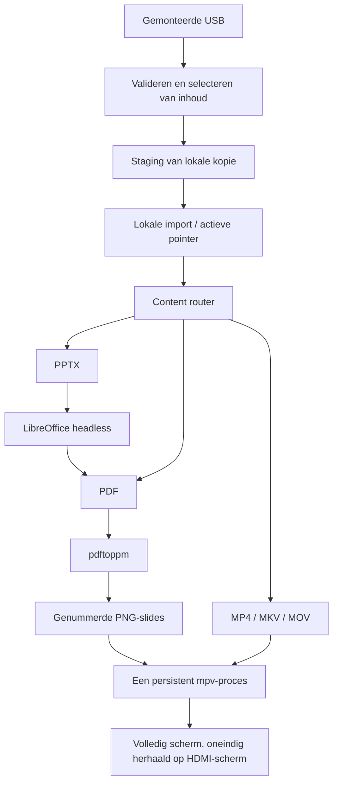

# PiPresent

> Zet een Raspberry Pi om naar een plug-and-play mediaspeler voor PowerPoint-, PDF- en videopresentaties.


Plaats een presentatie op een USB-stick, sluit de Raspberry Pi aan op een scherm en zet deze aan.
PiPresent kopieert de presentatie lokaal en speelt deze volledig schermvullend in een lus af. Zodra de weergave begint, kun je de USB-stick veilig verwijderen. Bij een volgende boot zonder USB-stick wordt de laatste geïmporteerde presentatie opnieuw afgespeeld.

**Doel:** Raspberry Pi 4 of nieuwer, Raspberry Pi OS 64-bit Desktop (Trixie), HDMI en een Wayland/labwc desktopomgeving. Recente Bookworm-systemen met labwc zijn ook bedoeld om te werken. Hardwareverificatie is nog niet afgerond: **HANDMATIGE RASPBERRY PI-TEST VERPLICHT**.

---

## Waarom PiPresent?

Herhaaldelijk stoppen en opnieuw starten van een videospeler tussen lussen kan een zwart scherm of een korte onderbreking in de desktop tonen. PiPresent start een enkel `mpv`-proces en laat de herhaling over aan `--loop-file=inf`. Slides worden afgespeeld via een `mpv`-afspeellijst met `--loop-playlist=inf`.

Zo wordt voorkomen dat het proces tussen loops opnieuw opstart; dit garandeert echter geen volledig naadloze decodering op elk apparaat en verwijderd ook geen zwarte frames die al in de bronvideo zijn ingebakken. Zie de [mpv-handleiding](https://mpv.io/manual/stable/).

---

## Functionaliteiten

- PowerPoint- en PDF-presentaties worden omgezet naar statische slides; MP4-, MKV- en MOV-bestanden worden direct afgespeeld.
- Strikte USB-selectie, configureerbare slide-duur, standaard 7 seconden wachttijd voor mount.
- Lokale imports met een gefaseerde kopie en atomische vervanging van de actieve cache-referentie.
- Ongewijzigde content wordt opnieuw gebruikt; de huidige en vorige import blijven behouden na succesvolle updates.
- Geen Python-runtime-afhankelijkheden; compacte, getypte toepassing met alleen de standaardbibliotheek.
- Diagnostiek, roterende applicatie-logs, installer, optionele labwc-autostart en deinstaller.

---

## Hoe het werkt



Zie [architectuur en trade-offs](docs/architecture.md).

---

## Snelstart

Het repository is lokaal voorbereid maar nog niet gepubliceerd. Vervang na publicatie `YOUR_GITHUB_OWNER` door de werkelijke eigenaar (zie [publishing](docs/publishing.md)):

```bash
git clone https://github.com/YOUR_GITHUB_OWNER/pipresent.git
cd pipresent
./scripts/install.sh --autostart
```

Voer de installer uit als de desktopgebruiker, zonder `sudo`. De installer vraagt alleen `sudo` voor `apt`.
Een internetverbinding is vereist om pakketten te installeren. De installer maakt een geïsoleerde virtuele omgeving aan en een launcher in `~/.local/bin/pipresent`.

Bereid een USB-stick voor, steek deze in, en start vanuit de Pi-desktop:

```bash
~/.local/bin/pipresent start
```

Voor unattended boot, schakel **desktop auto-login** in via de configuratietools van Raspberry Pi en zet schermblanking uit. Herstart met de USB-stick aangesloten. Zodra fullscreen weergave begint, gebruik de veilige ejectactie van de desktop voordat je de USB-stick verwijdert.

---

## USB-stick voorbereiden

Plaats bestanden in de root van de USB-stick, niet in een submap:

```text
USB/
├── presentation.pptx
└── presentation.json
```

```json
{
  "content": "presentation.pptx",
  "slide_duration": 8
}
```

`presentation.json` is optioneel wanneer precies één ondersteunde bestandsvorm aanwezig is. Zonder dit bestand:

| Ondersteunde bestanden | Resultaat |
| --- | --- |
| Geen | USB-stick wordt genegeerd tijdens detectie; cache wordt gebruikt als er geen bron verschijnt |
| Eén | Dat bestand wordt geselecteerd |
| Meerdere | Fout; geef `content` op in `presentation.json` |

`content` moet een bestandsnaam zijn in de root van de USB-stick, zonder padscheidingstekens. Matching is exact; extensies zijn hoofdletterongevoelig. Symlinks naar media en lege bestanden worden geweigerd. Als een geconfigureerd bestand ontbreekt of niet ondersteund is, stopt PiPresent met een duidelijke fout. Het kiest nooit stilzwijgend een ander bestand. `slide_duration` moet een positief, eindig JSON-getal zijn; standaard is 8 seconden. Onbekende JSON-sleutels worden genegeerd. De duur wordt genegeerd voor video.

Gemonteerde schijven worden ontdekt onder `/media/<huidige-gebruiker>/`. Een map is een mogelijke bron als deze `presentation.json` of een ondersteund bestandsnaam bevat. Niet-gerelateerde schijven worden genegeerd; meerdere potentiële bronnen veroorzaken een fout. PiPresent wacht maximaal zeven seconden op een bron, daarna wordt de cache gebruikt. Het monteert schijven niet zelf en bewaakt ook geen latere invoeging. Detectie stopt zodra een bron is gevonden; sluit alle schijven aan voordat je start.

---

## Ondersteunde formaten en gedrag van PowerPoint

| Formaat | Afspelen |
| --- | --- |
| `.pptx` | LibreOffice → PDF → PNG → statische slideshow |
| `.pdf` | pdftoppm → PNG → statische slideshow |
| `.mp4`, `.mkv`, `.mov` | mpv-videolus, met bronaudio |

**PowerPoint-animaties, Morph-overgangen, ingebedde videoweergave, interactieve content en PowerPoint-specifieke effecten worden niet ondersteund in v0.1.** Elke slide gebruikt dezelfde duur. Installeer de lettertypen die in de presentatie worden gebruikt op de Pi; LibreOffice kan slides anders uitlijnen dan Microsoft PowerPoint. Het vooraf exporteren naar PDF geeft een meer voorspelbare layout. Bestandsextensies bepalen de route; succesvolle decodering hangt nog steeds af van geldige media en codecs.

---

## Installatie en autostart

```bash
./scripts/install.sh             # alleen handmatige start
./scripts/install.sh --autostart # tevens starten na labwc-start
```

De installer installeert `python3`, `python3-venv`, `python3-pip`, `mpv`,
`libreoffice-impress` en `poppler-utils`, installeert deze checkout als een normaal pakket in
`~/.local/share/pipresent-app/venv`, maakt runtime-mappen aan en voert `doctor` uit.
Voeg `~/.local/bin` toe aan je shell `PATH` als je de korte opdracht `pipresent` wilt gebruiken.
Voer de installer opnieuw uit na het bijwerken van de checkout. Hij weigert niet-gerelateerde installatiepaden of launchers. Het wijzigen van XDG-instellingen tussen installatie en deïnstallatie wordt niet ondersteund.

Autostart voegt een blok met `# PiPresent BEGIN` / `# PiPresent END` toe aan
`~/.config/labwc/autostart` en bewaart andere invoer. Het oorspronkelijke bestand wordt als eerste wijziging opgeslagen als `autostart.pipresent.bak`. Herinstallatie voegt het blok niet nogmaals toe.
De launcher draait in de achtergrond nadat de desktopsessie is gestart; er wordt geen systeemservice gebruikt.
Bij oudere Bookworm-desktops met Wayfire/X11 gebruik je de eigen autostartmethode van die desktop.

Om automatische start uit te schakelen, verwijder alleen het gemarkeerde blok. Voor deïnstallatie:

```bash
./scripts/uninstall.sh         # behoudt presentaties, cache en logs
./scripts/uninstall.sh --purge # toont paden en vraagt om PURGE in te typen
```

Stop afspelen met `q` (of Ctrl+C in het terminalvenster) voordat je bijwerkt of deïnstalleert. Deïnstallatie verwijdert de eigen toepassing, launcher en autostartblok. Het laat apt-pakketten en het oorspronkelijke autostart-backup achter. Purge verwijdert alleen de PiPresent-appdata permanent.

---

## CLI

```bash
pipresent --help
pipresent --version
pipresent doctor
pipresent start
pipresent start --wait 3 --usb-root /media/myuser
pipresent play /path/to/video.mp4
pipresent play /path/to/slides.pdf --slide-duration 5
```

`start` importeert USB-media voordat afspelen begint; `play` gebruikt direct het opgegeven pad en importeert het niet. Verwijder geen drive die wordt gebruikt door `play`. Start één PiPresent-instance per desktop. Afspelen eindigt wanneer je `q` indrukt in `mpv`; een onverwachte spelerstop wordt gelogd, niet opnieuw gestart. Fouten geven exit-code 1, ongeldige CLI-argumenten 2, en Ctrl+C 130.

`doctor` rapporteert PASS/WARN/FAIL, geeft exit-code 1 bij ontbrekende tools of onbeschrijfbare mappen en waarschuwt bij een ontbrekende displayomgeving of cache. Displayvariabelen bewijzen niet dat een Wayland-verbinding of HDMI-uitvoer werkt; test playback op de echte Pi.

---

## Opslag en logs

| Standaardmap | Doel |
| --- | --- |
| `~/.local/share/pipresent/` | Geïmporteerde media, configuratie en actieve `current`-pointer |
| `~/.cache/pipresent/` | Tijdsgebonden PDF-, LibreOffice-profiel- en PNG-slides |
| `~/.local/state/pipresent/pipresent.log` | Roterende applicatielog (2 MB × vier bestanden) |
| `~/.local/state/pipresent/autostart.log` | Sessie-launcher en output van externe tools |

Absolute `XDG_DATA_HOME`, `XDG_CACHE_HOME`, `XDG_STATE_HOME` en installer-`XDG_CONFIG_HOME`-overschrijvingen worden gerespecteerd; relatieve overschrijvingen vallen terug op standaardwaarden. De geïnstalleerde launcher onthoudt de data-/cache-/state-locaties die bij installatie zijn gekozen. Autostart-output wordt toegevoegd en niet geroteerd; controleer en comprimeer dit logbestand af en toe terwijl playback is gestopt. Onderbroken renders kunnen cachemappen achterlaten; deze kunnen worden verwijderd terwijl PiPresent is gestopt. Plaats nooit niet-gerelateerde bestanden in de speciale PiPresent-mappen.

---

## Schermblanking en troubleshooting

Zet schermblanking uit via Raspberry Pi OS **Control Centre → Display → Screen Blanking**
(op oudere versies: Raspberry Pi Configuration → Display). Je kunt ook `sudo raspi-config` gebruiken en daarna **Display Options → Screen Blanking**. Menunamen kunnen verschillen per image; zie de [officiële Raspberry Pi-documentatie](https://www.raspberrypi.com/documentation/computers/configuration.html#screen-blanking). PiPresent past de display-energie-instellingen of desktop auto-login niet aan.

Begin met `pipresent doctor` en de applicatielog. Zie de [troubleshooting-gids](docs/troubleshooting.md) voor USB-, lettertype-, conversie-, display- en opstartproblemen.

---

## Ontwikkeling en testen

Python 3.11+ op Linux, macOS of Windows is voldoende voor unit-tests:

```bash
python -m venv .venv
# Linux/macOS:
. .venv/bin/activate
# Windows PowerShell in plaats daarvan: .venv\Scripts\Activate.ps1
python -m pip install -e ".[dev]"
ruff check .
ruff format --check .
mypy src
pytest -q
pipresent --help
```

Tests gebruiken tijdelijke directories en mock-subprocesses; er is geen Pi, USB, LibreOffice of GUI nodig.
GitHub Actions definieert Linux/macOS/Windows-jobs op Python 3.11 en 3.13.
CI-status is nog niet geverifieerd totdat publicatie plaatsvindt. Zie [release validation](docs/validation.md) en de [handmatige Pi-acceptatiechecklist](docs/acceptance.md).

---

## Huidige beperkingen

- Alleen import bij opstarten; geen hot replacement, planning of gemengde mediaplaylists.
- Vereist een al gemonteerde drive en een actieve grafische desktopsessie.
- Statische slides, uniforme timing, langste rand 1920 pixels; conversie kan tijd kosten bij grote presentaties.
- Conversietijden verlopen na vijf minuten per tool. Geen voortgangsscherm tijdens conversie.
- Ongeldige of dubbelzinnige USB-bronnen falen zichtbaar in logs, zelfs als een cache bestaat; verwijder de slechte bron om de vorige cache terug te gebruiken. Er is nog geen on-screen fout-UI.
- Importcontrole valideert selectie, extensie, niet-lege bestanden en integriteit van de kopie, niet de renderbaarheid.
  Een geldig gekopieerd maar corrupt document wordt current; de vorige import blijft behouden voor herstel.
- Staging heeft schijfruimte nodig voor een extra import en gegenereerde slides. Plotselinge stroomuitval, SD-kaartschade en gelijktijdige starts vallen buiten de atomic-copy-garantie.
- Inhoud wordt verwerkt door lokale desktoptools; gebruik vertrouwde presentaties en houd de Pi up-to-date.

---

## Roadmap

- v0.2: hot USB replacement, gemengde playlists, geplande content.
- v0.3: lichte lokale beheer- en externe health checks.
- Toekomst: beheer van meerdere schermen in een cluster.

Ontwikkeld als een avondproject dat gericht is op automatisering, betrouwbaarheid en het omzetten van een echt operationeel probleem in een herbruikbare Raspberry Pi-tool.

Pierrick Van Hoecke · AI & Automation Engineer

---

## Licentie

[MIT](LICENSE) © 2026 Pierrick Van Hoecke.
